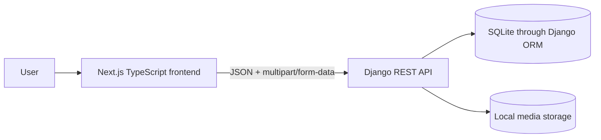
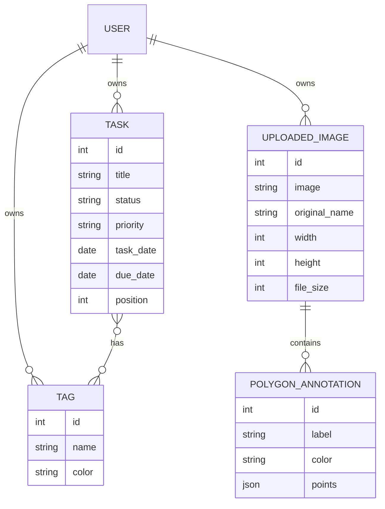
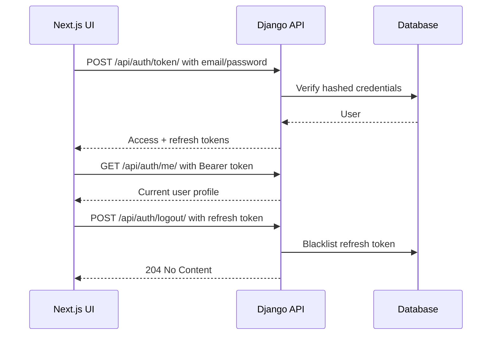
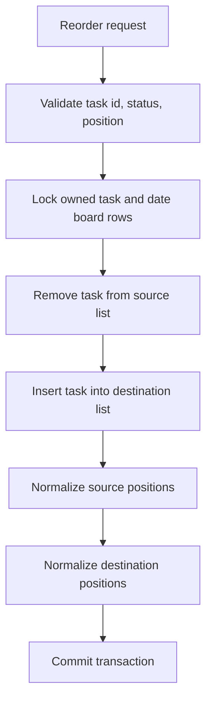
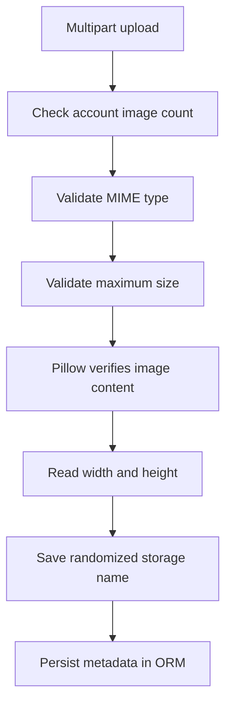

# MarkFlow Backend Architecture

## System context



The frontend and backend are deployed independently. The API accepts exact allowed frontend origins through CORS configuration.

## Django application boundaries

```text
apps.accounts
├── custom email-based User
├── JWT current-user endpoint
├── logout and token blacklisting
└── demo-account management command

apps.tasks
├── Task and Tag models
├── date-filtered CRUD
├── tag creation from task input
└── transaction-safe reordering service

apps.annotations
├── UploadedImage model and upload validation
├── PolygonAnnotation model
├── image ownership boundary
└── polygon CRUD and validation
```

Business logic that changes multiple task rows lives in `apps/tasks/services.py`, rather than being embedded in the API view.

## Data relationships



## Authentication flow



Access tokens expire after 30 minutes. Refresh tokens expire after seven days. The frontend is responsible for storing and refreshing tokens according to its chosen client-side strategy.

## Date-based task flow

`task_date` controls which daily board displays the task. `due_date` is an optional deadline. Keeping the fields separate prevents a deadline from unintentionally moving a task to another day's board.

A new task receives the next zero-based position within this scope:

```text
user + task_date + status
```

## Reordering transaction



The service uses `select_for_update`, `transaction.atomic`, and `bulk_update`. This keeps positions contiguous and reduces the risk of overlapping requests producing duplicate or missing positions.

## Image upload flow



The original filename remains metadata, while the stored filename uses a UUID under a user-specific directory.

## Responsive polygon coordinate strategy

Canvas pixels are not stored directly. The frontend converts every coordinate to a normalized value:

```text
normalized_x = canvas_x / displayed_image_width
normalized_y = canvas_y / displayed_image_height
```

The API stores values between `0` and `1`. When the image is displayed at another size, the frontend converts them back:

```text
canvas_x = normalized_x × displayed_image_width
canvas_y = normalized_y × displayed_image_height
```

This keeps polygons aligned across laptop, tablet, and responsive layouts.

## Authorization boundary

Every private queryset is scoped to `request.user`.

```text
Task.objects.filter(user=request.user)
UploadedImage.objects.filter(user=request.user)
PolygonAnnotation.objects.filter(image__user=request.user)
```

Requests for another user's object return `404`, preventing resource enumeration.

## Persistence and free-tier trade-offs

The recruiter demo uses:

- SQLite for relational data;
- the backend server filesystem for uploaded media;
- a 20-image account limit;
- a 5 MB per-file limit.

This keeps the assignment deployable without paid services. For a larger production system, move to PostgreSQL and durable object storage, add background image processing, and introduce backup and observability services.
